[](https://gitee.com/cook-csharp/CookPopularControl)

# Welcome to CookPopularControl 

[](https://github.com/chancezheng/CookPopularControl/actions/workflows/nuget-push.yml)
[](https://sonarcloud.io/summary/new_code?id=campaigns-auxiliary-service)
[](https://jq.qq.com/?_wv=1027&k=hVVHKJ1V) 

[](https://gitee.com/cook-csharp/CookPopularControl) [](https://gitee.com/cook-csharp/CookPopularControl/blob/chance_dev/LICENSE) [](https://www.nuget.org/packages/CookPopularControl) [](https://www.nuget.org/packages/CookPopularControl) []()

[](https://gitee.com/cook-csharp/CookPopularControl) [](https://gitee.com/cook-csharp/CookPopularControl) 
[](https://github.com/chancezheng/CookPopularControl) [](https://github.com/chancezheng/CookPopularControl)

## **介绍**
CookPopularControl（WPF控件库）、CookPopularCSharpToolkit（C#的一个工具库，提供大量的公共方法）是兼容.NetFramework、.NetCore、.Net5.0/6.0，其中参考了一些资料，CookPopularControl目前提供了近80款左右的控件，持续更新，如果你的项目用到此库，不要忘记点个赞，有问题可加QQ群交流：658794308，欢迎大家参与开发和指出问题。
***

## **代码检测**
[](https://sonarcloud.io/project/configuration?analysisMode=GitHubActions&id=chancezheng_CookPopularControl)

## **使用**
- Install-Package CookPopularControl -Version 1.02
- Install-Package CookPopularCSharpToolkit --version 1.02

- 添加如下代码即可全部引用
    ```
    <Application.Resources>
        <ResourceDictionary>
            <ResourceDictionary.MergedDictionaries>
                <ResourceDictionary Source="pack://application:,,,/CookPopularControl;component/Themes/DefaultPopularColor.xaml"/>
                <ResourceDictionary Source="pack://application:,,,/CookPopularControl;component/Themes/DefaultPopularControl.xaml"/>
            </ResourceDictionary.MergedDictionaries>
        </ResourceDictionary>
    </Application.Resources>
    ```

- **Themes**
    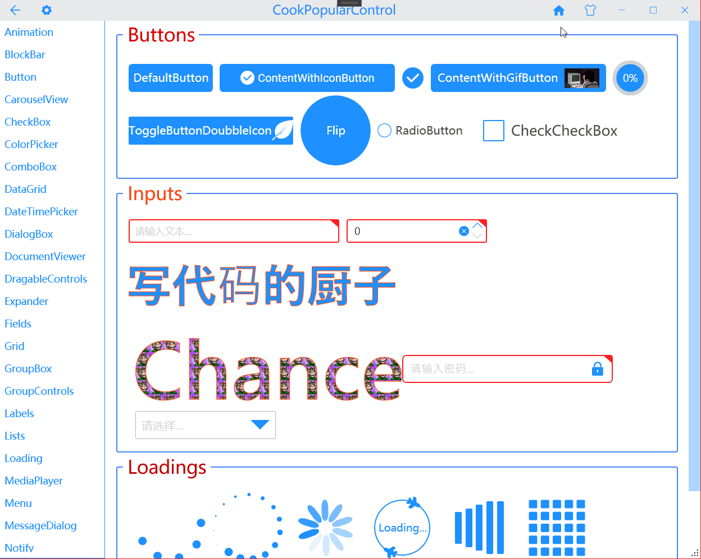

- **Animations**
    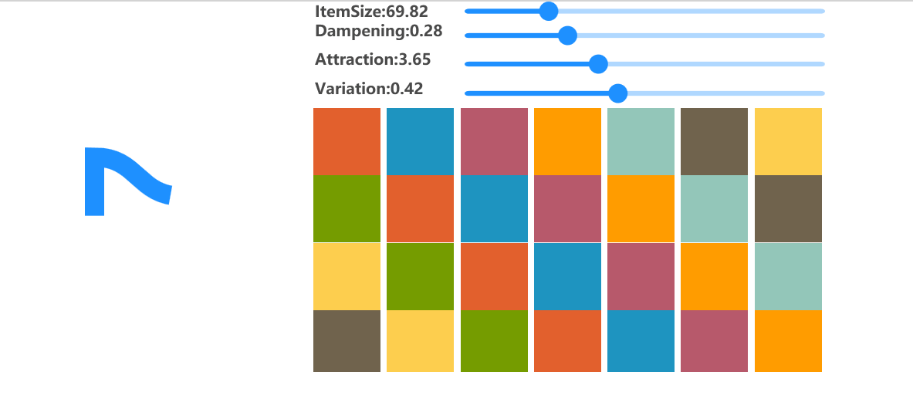

- **Button**
    

- **BlockBars**
    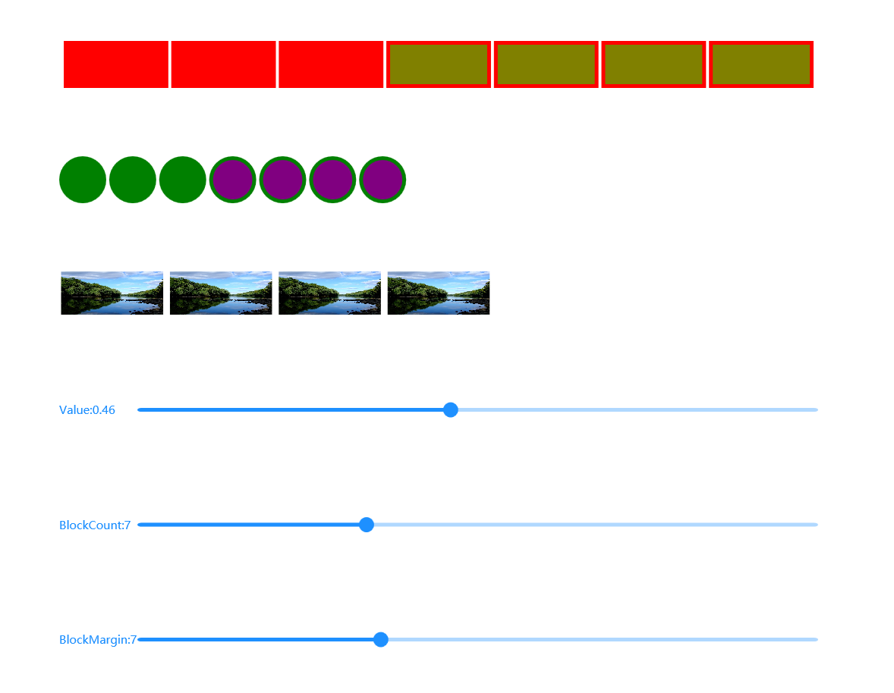   

- **CarouselView**
    

- **CheckBox**
    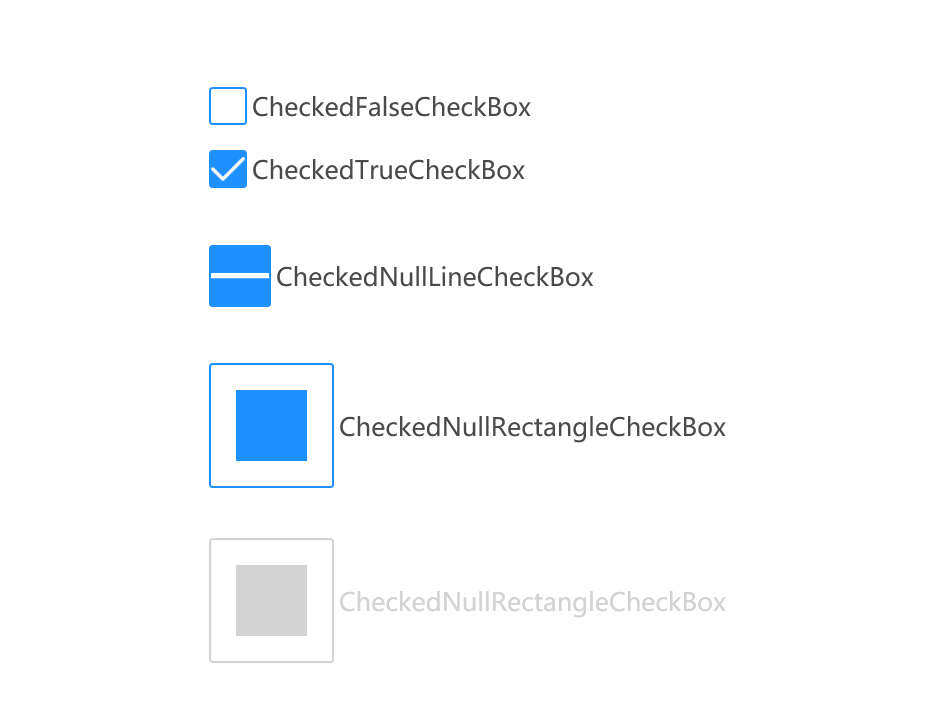

- **ColorPicker**
    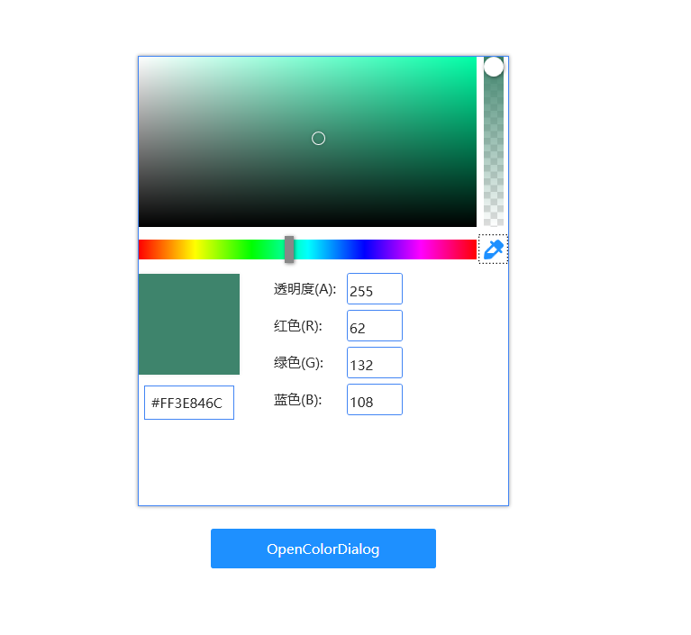

- **ComboBox**
    

- **DataGrid**
    

- **DateTimePicker**
    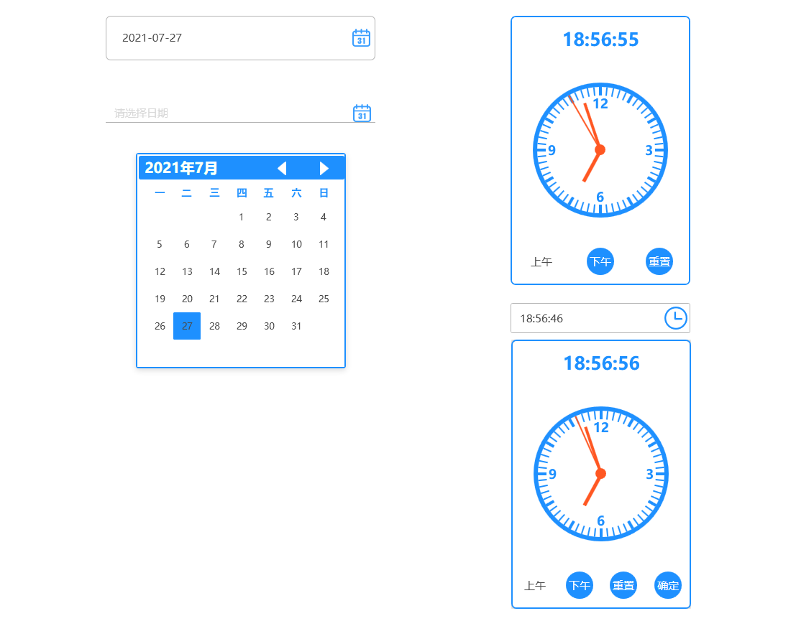 

- **DialogBox**
    

- **Expander**
    

- **Fields**
    

- **Grid**
    

- **GroupBox**
    

- **GroupControls**
    
        
- **Labels**
    
    
- **Lists**
    

- **Loading**
    

- **MediaPlayer**
    

- **Menu**
    

- **MessageDialog**
    

- **Notify**
    
    

- **OtherControls**
    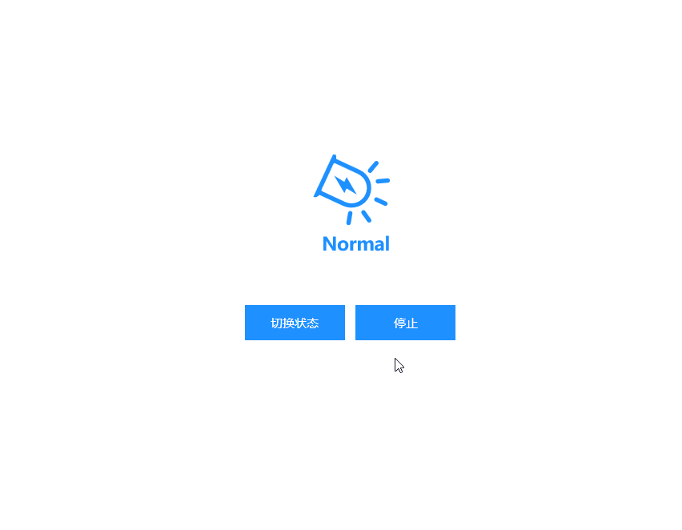
    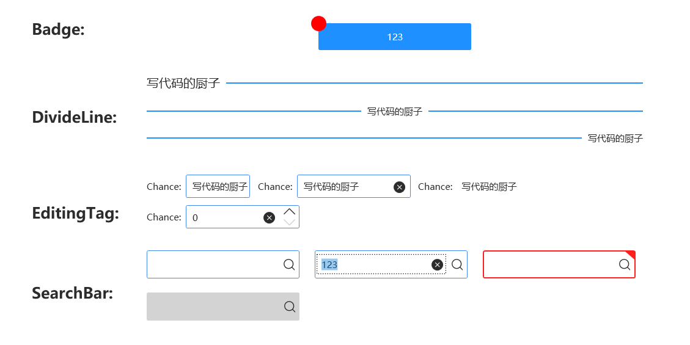

- **PasswordBox**
    

- **ProgressBar**
    

- **PropertyGrid**
    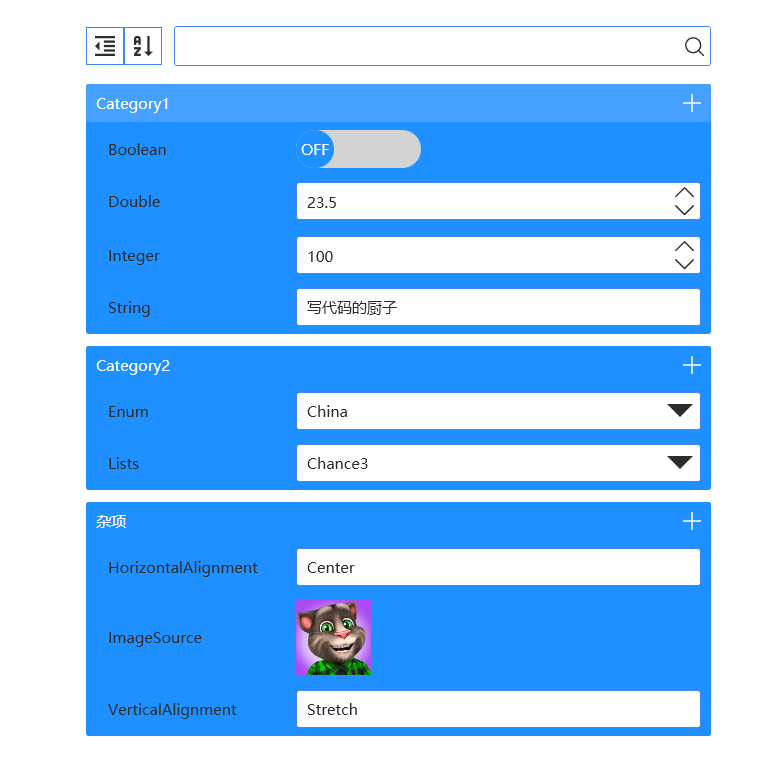

- **QRCode/BarCode**
    

- **RadioButton**
    

- **ScrollViewer**
    

- **Slider**
    
    
- **Star**
    

- **Swiper**
    

- **SwitchButton**
    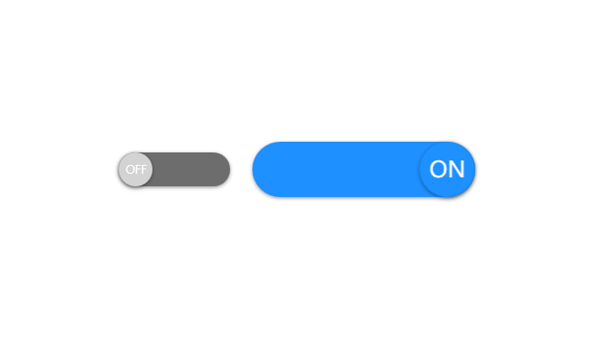

- **TabControl**
    

- **ThreeDimensionalControls**
    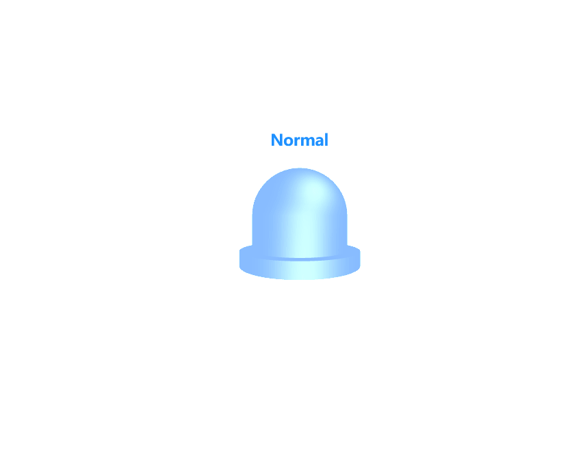

- **ToggleButton**
    

- **ToolBar**
    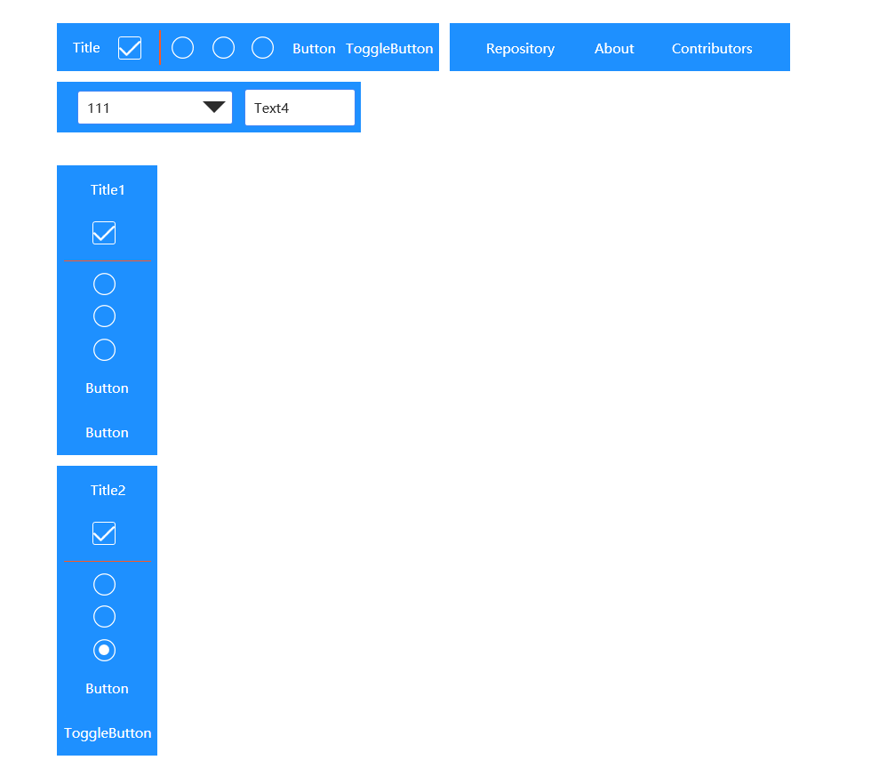
    
- **TreeView**
    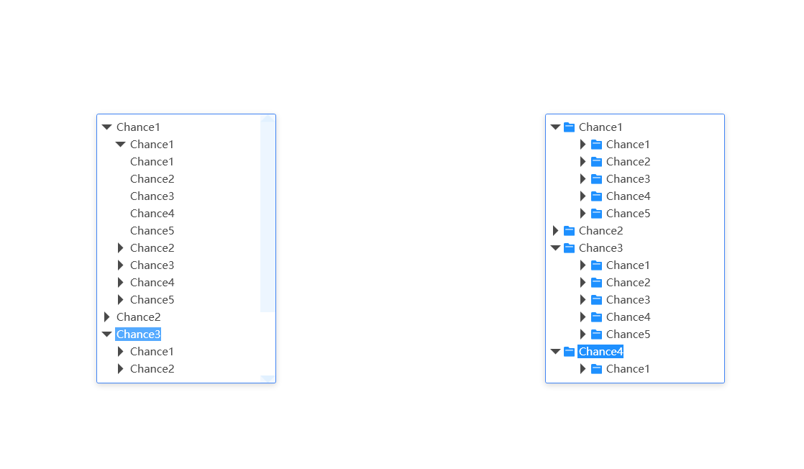

<!-- ### &#8627; Stargazers
[](https://gitee.com/cook-csharp/CookPopularControl/stargazers)

### &#8627; Forkers
[](https://gitee.com/cook-csharp/CookPopularControl/members) -->

<!-- ## ‎‍💻 Code Contributors

 -->

## ⭐️ Stargazers


<!-- ## 🏆 Forkers

 -->