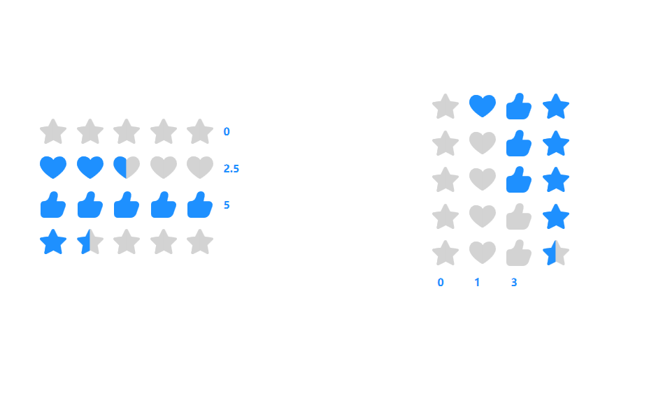

[](https://gitee.com/cook-csharp/CookPopularControl)

# Welcome to CookPopularControl

## 介绍
CookPopularControl是支持.NetFramework4.6.1与.Net5.0的WPF控件库，其中参考了一些资料，目前提供了多达60款左右的控件，还在更新中，感兴趣的可以持续关注下，如果你的项目用到此库，不要忘记点个赞，有问题可加QQ群交流：658794308，欢迎大家参与开发和指出问题，谢谢！
***

# Useage
- Install-Package CookPopularControl -Version 1.0.0.1-alpha01

- 添加如下代码即可全部引用
    ```
    <Application.Resources>
        <ResourceDictionary>
            <ResourceDictionary.MergedDictionaries>
                <ResourceDictionary Source="pack://application:,,,/CookPopularControl;component/Themes/DefaultPopularControl.xaml"/>
                <ResourceDictionary Source="pack://application:,,,/CookPopularControl;component/Backcolors/DefaultPopularColor.xaml"/>
            </ResourceDictionary.MergedDictionaries>
        </ResourceDictionary>
    </Application.Resources>
    ```

- **OverViewer**
    

- **AnimationPath**
    

- **Button**
    

- **CarouselView**
    

- **CheckBox**
    

- **ComboBox**
    

- **DataGrid**
    

- **DatePickerTimer**
    

- **DialogBox**
    

- **Expander**
    

- **Fields**
    

- **Grid**
    

- **GroupBox**
    

- **GroupControls**
    
        
- **Labels**
    
    
- **Lists**
    

- **Loading**
    

- **MediaPlayer**
    

- **Menu**
    

- **MessageDialog**
    

- **Notify**
    
    

- **PasswordBox**
    

- **ProgressBar**
    

- **QRCode**
    

- **RadioButton**
    

- **ScrollViewer**
    

- **Slider**
    
    
- **Star**
    

- **Swiper**
    

- **TabControl**
    

- **ToggleButton**
    